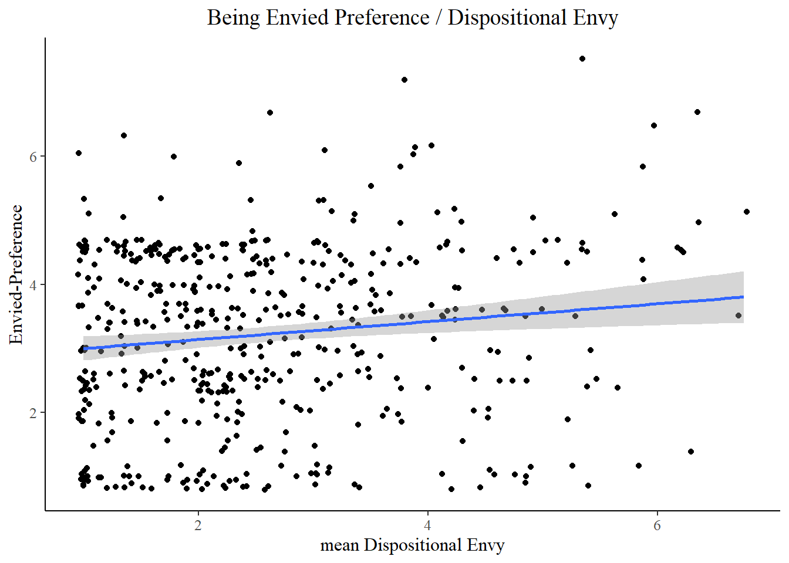

#Data wrangling

```r
#Load data
Dat <- read.csv("Prolific-500participants-Numeric.csv",TRUE)

library("tidyverse")
#Delete the participants' data that fail the attention checks
Dat_attention_check_passed <- Dat %>% filter(Attention1 == 1)

type_gender_know <- Dat_attention_check_passed %>% select(Gender, Prolific.ID, starts_with(c("Body","Judgment")))
#type_gender_know <- 
  #type_gender_know %>% 
 # rename(Body.Naked_1 = Body.Naked._1, Body.Naked_2 = Body.Naked._2)
test <- type_gender_know %>% select(Gender, Body.Bowel_1, Body.Bowel_2)

test %>% pivot_longer(cols=c(Body.Bowel_1, Body.Bowel_2), names_to = "doctor_type", values_to = "scores", names_prefix="Body.Bowel_")
```

```
## # A tibble: 990 x 3
##    Gender doctor_type scores
##     <int> <chr>        <int>
##  1      2 1                6
##  2      2 2                4
##  3      2 1                2
##  4      2 2                2
##  5      2 1                3
##  6      2 2                6
##  7      2 1                5
##  8      2 2                5
##  9      2 1                4
## 10      2 2                3
## # ... with 980 more rows
```

```r
repeated_ready1 <- 
type_gender_know %>% 
  pivot_longer(cols = starts_with(c("Judgment", "Body")), 
                 values_to = "scores", 
                 names_to = (c("Type", "Sub", "Doctor")),
               names_pattern = c("(.*)\\.(.*)_(.)"))
```


```r
# Doctor and Type or Embarrassment on Rating

repeated_ready1$Doctor <- as.factor(repeated_ready1$Doctor)
repeated_ready1$Doctor <- recode_factor(repeated_ready1$Doctor, "1" = "NOT Know","2" = "Know")

repeated_ready1%>% 
  ggplot() +
  aes(x = Doctor, color = Type, group = Type, y = scores) +
  stat_summary(fun.y = mean, geom = "point") +
  stat_summary(fun.y = mean, geom = "line")+
  labs(y = "Embarassment Rating")+
  theme (plot.title = element_text(hjust = 0.5), text = element_text(family = "serif", size = 12), 
         panel.grid.major = element_blank(), 
         panel.grid.minor = element_blank(),
         panel.background = element_blank(), 
         axis.line = element_line(colour = "black"))+
          ggtitle("Doctor and Type of Embarassment on Rating")+
          stat_summary(fun.data = "mean_se",geom = "errorbar", size = 0.05,width = 0.2)+
           scale_y_continuous(limits = c(1, 7))
```


```r
# Gender and Type of Embarrassment on Rating
repeated_ready1$Gender <- as.factor(repeated_ready1$Gender)
repeated_ready1$Gender<- recode_factor(repeated_ready1$Gender, "1" = "Male","2" = "Female")
repeated_ready1%>% 
  ggplot() +
  aes(x = Type, color = Gender, group = Gender, y = scores) +
  stat_summary(fun.y = mean, geom = "point") +
  stat_summary(fun.y = mean, geom = "line")+
  labs(y = "Embarassment Rating")+
  theme (plot.title = element_text(hjust = 0.5), text = element_text(family = "serif", size = 12), 
         panel.grid.major = element_blank(), 
         panel.grid.minor = element_blank(),
         panel.background = element_blank(), 
         axis.line = element_line(colour = "black"))+
          ggtitle("Gender and Type of Embarassment on Rating")+
          stat_summary(fun.data = "mean_se",geom = "errorbar", size = 0.05,width = 0.2)+
           scale_y_continuous(limits = c(1, 7))
```


```r
# Doctor and SubTypes of Embarassment on Rating
repeated_ready1%>% 
  ggplot() +
  aes(x = Doctor, color = Sub, group = Sub, y = scores) +
  stat_summary(fun.y = mean, geom = "point") +
  stat_summary(fun.y = mean, geom = "line")+
  labs(y = "Embarassment Rating")+
  theme (plot.title = element_text(hjust = 0.5), text = element_text(family = "serif", size = 12), 
         panel.grid.major = element_blank(), 
         panel.grid.minor = element_blank(),
         panel.background = element_blank(), 
         axis.line = element_line(colour = "black"))+
  ggtitle("Doctor and SubTypes of Embarassment on Rating")+
  stat_summary(fun.data = "mean_se",geom = "errorbar", size = 0.05,width = 0.2)+
   facet_wrap(.~Type)+
   scale_y_continuous(limits = c(1, 7))
```


```r
model1<- aov(scores ~ Gender*Type*Doctor+Error(Prolific.ID/Type*Doctor), data = repeated_ready1)
summary(model1)
```

```
## 
## Error: Prolific.ID
##              Df Sum Sq Mean Sq F value   Pr(>F)    
## Gender        1    567   566.6  25.110 7.58e-07 ***
## Type          1     31    31.2   1.382    0.240    
## Doctor        1      4     3.6   0.160    0.689    
## Gender:Type   1      7     7.4   0.329    0.567    
## Residuals   490  11056    22.6                     
## ---
## Signif. codes:  0 '***' 0.001 '**' 0.01 '*' 0.05 '.' 0.1 ' ' 1
## 
## Error: Doctor
##      Df   Sum Sq  Mean Sq
## Type  1 0.007624 0.007624
## 
## Error: Prolific.ID:Type
##                Df Sum Sq Mean Sq F value Pr(>F)  
## Type            1      0    0.13   0.017 0.8957  
## Gender:Type     1     37   36.51   4.869 0.0278 *
## Gender:Doctor   1      0    0.46   0.061 0.8052  
## Type:Doctor     1     13   13.42   1.790 0.1816  
## Residuals     491   3682    7.50                 
## ---
## Signif. codes:  0 '***' 0.001 '**' 0.01 '*' 0.05 '.' 0.1 ' ' 1
## 
## Error: Prolific.ID:Doctor
##                     Df Sum Sq Mean Sq F value Pr(>F)
## Gender:Doctor        1    4.9   4.923   1.390  0.239
## Type:Doctor          1    0.0   0.042   0.012  0.913
## Gender:Type:Doctor   1    0.7   0.660   0.186  0.666
## Residuals          491 1739.1   3.542               
## 
## Error: Prolific.ID:Type:Doctor
##                     Df Sum Sq Mean Sq F value Pr(>F)    
## Type:Doctor          1  262.1  262.06 145.777 <2e-16 ***
## Gender:Type:Doctor   1    0.8    0.83   0.464  0.496    
## Residuals          493  886.2    1.80                   
## ---
## Signif. codes:  0 '***' 0.001 '**' 0.01 '*' 0.05 '.' 0.1 ' ' 1
## 
## Error: Within
##             Df Sum Sq Mean Sq F value Pr(>F)
## Residuals 3956   7432   1.879
```
Significant interaction of Doctor type and Embarrassment type: F(**1**,**493**) = **145.78**, p <**0.01**
 
Significant interaction of Gender and Embarrassment type: F(**1**,**491**) = **4.87**, p = **0.0279**
 
Significant Main effect of Gender: F(**1**,**490**) = **25.11**, p < **0.01**
 
 
 
Non-Significant Main effect of Doctor type: F(**1**,**490**) = **0.16**, p  = **0.69**
 
Non- Significant Main effect of Embarrassment type: F(**1**,**491**) = **0.017**, p = **0.90**
 
Non-Significant interaction of Gender and Doctor type: F(**1**,**491**) = **1.39**, p = **0.239**

Non-Significant  three-way interaction of Gender/Doctor type/Embarrassment type: F(**1**,**491**) = **0.186**, p = **0.666**


```r
Dat1<- Dat_attention_check_passed %>% mutate(DispEnvy = (Envy1+Envy2+Envy3+Envy4+Envy5+Envy6+Envy7+Envy8)/8)
Dat1<- Dat1 %>% mutate(EnviedPreference=(Envied.PA.Preference+Envied.FC.Preference)/2)
Dat1<- Dat1 %>% mutate(EnviedEnjoyment=(Envied.PA.Enjoyment+Envied.FC.Enjoyment)/2)
```


```r
ggplot(Dat1, aes(x= DispEnvy, y = Dat1$Envied.Enjoyment))+
  geom_jitter()+
  labs(y = "Envied-Enjoyment-Recall", x = "mean Dispositional Envy")+
  theme (plot.title = element_text(hjust = 0.5), text = element_text(family = "serif", size = 12), 
         panel.grid.major = element_blank(), 
         panel.grid.minor = element_blank(),
         panel.background = element_blank(), 
         axis.line = element_line(colour = "black"))+
         geom_smooth(method = lm)+
         ggtitle("Recall Enjoyment of Envy / Dispositional Envy")
```


```r
cor.test(Dat1$DispEnvy,Dat1$Envied.Enjoyment)
```

```
## 
## 	Pearson's product-moment correlation
## 
## data:  Dat1$DispEnvy and Dat1$Envied.Enjoyment
## t = 2.2667, df = 285, p-value = 0.02416
## alternative hypothesis: true correlation is not equal to 0
## 95 percent confidence interval:
##  0.01756224 0.24507750
## sample estimates:
##       cor 
## 0.1330726
```

**Report:** Dispositional envy significantly correlated with enjoyment of being envied in the past recalled event of being envied: r(**285**) = **0.133**, p = **0.024**


```r
ggplot(Dat1, aes(x= DispEnvy, y = Dat1$EnviedPreference))+
  geom_jitter()+
  labs(y = "Envied-Preference", x = "mean Dispositional Envy")+
  theme (plot.title = element_text(hjust = 0.5), text = element_text(family = "serif", size = 12), 
         panel.grid.major = element_blank(), 
         panel.grid.minor = element_blank(),
         panel.background = element_blank(), 
         axis.line = element_line(colour = "black"))+
         geom_smooth(method = lm)+
         ggtitle("Being Envied Preference / Dispositional Envy")
```



```r
cor.test(Dat1$DispEnvy,Dat1$EnviedPreference)
```

```
## 
## 	Pearson's product-moment correlation
## 
## data:  Dat1$DispEnvy and Dat1$EnviedPreference
## t = 2.9807, df = 493, p-value = 0.003018
## alternative hypothesis: true correlation is not equal to 0
## 95 percent confidence interval:
##  0.0454492 0.2186182
## sample estimates:
##      cor 
## 0.133049
```
**Report:** Dispositional envy significantly correlated with preference for being  envied-inducing situations : r(**493**) = **0.133**, p = **0.003**


```r
ggplot(Dat1, aes(x= DispEnvy, y = Dat1$EnviedEnjoyment))+
  geom_jitter()+
  labs(y = "Envied-Enjoyment", x = "mean Dispositional Envy")+
  theme (plot.title = element_text(hjust = 0.5), text = element_text(family = "serif", size = 12), 
         panel.grid.major = element_blank(), 
         panel.grid.minor = element_blank(),
         panel.background = element_blank(), 
         axis.line = element_line(colour = "black"))+
         geom_smooth(method = lm)+
         ggtitle("Envied-Enjoyment / Dispositional Envy")
```


```r
cor.test(Dat1$DispEnvy,Dat1$EnviedEnjoyment)
```

```
## 
## 	Pearson's product-moment correlation
## 
## data:  Dat1$DispEnvy and Dat1$EnviedEnjoyment
## t = 5.2322, df = 493, p-value = 2.482e-07
## alternative hypothesis: true correlation is not equal to 0
## 95 percent confidence interval:
##  0.1441459 0.3112067
## sample estimates:
##       cor 
## 0.2293648
```
**Report:** Dispositional envy significantly correlated with preference for being  envied-inducing situations : r(**493**) = **0.23**, p < **0.001**


